# 交易框架

> 来源：`data/raw/notes/交易框架.xmind`（未改原文件）· 同步：2026-08-17  
> 性质：A 股波段交易系统全文提纲（事实为导图原文梳理；非荐股）  
> 与 `可执行交易框架.md`、`炒股赚米的核心.md`、`my-soul.md` 有重叠；**升格为硬规则前须用户确认**  
> 模型示意图已从导图抽出，放在同目录 `交易框架-assets/`

---

## 总览

根节点：**股票交易系统**。分析顺序：**先大盘 → 再板块 → 后个股**。

核心分工：**大盘管仓位，个股管买卖。**

买前七问：空间够不够 → 支不支撑 → 有没有启动信号（至少两个）→ 盈亏比 → 怎么拿 → 止损清不清晰 → 交给执行力。

好买点四要素：**趋势、空间、位置、量能**；强势板块 + 上升趋势（有筑底）+ 共振支撑 + 买点启动信号。

## 目录

1. 好买点（稳健买点）
2. 买股票前需要考虑的问题
3. 趋势分析
4. 选股策略
5. 买点位置
6. 起涨确认
7. 空间盈亏比
8. 持仓技术
9. 止盈止损
10. 仓位风控管理
11. 波段体系的核心思想
12. 模式
13. 技术分析
14. 每日复盘
15. 情绪分析
16. 周期
17. 注意要点
18. 利弗莫尔告诉我们
19. 交易策略

---

## 一、好买点（稳健买点）

- 趋势，空间，位置，量能
- 强势板块 + 上升趋势（有上升空间，前期有过筑底特征）+ 支撑位置（共振支撑） + 买点信号（买点启动信号）
- 中期有潜力，短期有买点，才算好票
- 支撑和压力被激发了才有用，支撑达到的次数越多，支撑位置越得到确认，但是对于买点是不安全的，压力达到的次数越大，压力会被削弱的
- 上涨找压力，下跌找支撑
- **历史会不断地重演，但不会简单的重复。真正的交易是什么：分析和交易是独立的**
  - 分析是分析，交易是交易，分析是帮你看懂行情的走势变化，交易在走势变化之下，制定你的出击方案，做确定性的机会，做大概率，交易远比分析复杂的多，考虑的也多，包括但不限于足够的上涨空间，有支撑，买点信号，止损位置等等，这就是分析出来有机会不一定做的原因

- 机会不是追出来的，而是等来的
- 技术要有，策略也要跟进
- 任何人都赚不到认知以外的钱，盈亏同源，因为我的技术，我没抓到弱势启动的行情，但也可以规避无力的上涨而引起的下跌，即使以后大涨放掉了不要后悔，要无条件的执行自己的框架，因为任何技术都有利有弊，优化抓顺势行情的能力，而不是放掉顺势行情，专做逆势行情
- 交易是大概率事件，再牛的技术也没有百分之百，要有止损意识，控制回撤，买进以后市场行情没有按照预期走，该损则损，正确的时候多赚钱，错误的时候少亏钱，
- 投资千万条，记录第一条，要有执行力，做好风控，才能在市场中稳步前进
- 投资市场要学会放过自己，追求交易完美的人在股票市场是活不下去的，不要追求买在最低点，卖在最高点，承认平庸，学会妥协，是把握核心利润的关键，能有好的心态才能活得长久，完美主义者最后结果都特别惨，回撤较大，不能持续稳定盈利
- 行情不打止损不要走，现在的行情轮动快，你的票没涨，只不过资金热点还没有轮动到，不要随意折腾，越折腾越不赚钱，不要这山望着那山高，捡了芝麻丢了西瓜，打了止损的票一定要走，不要留恋
- 先出现异动，加入观察+回调支撑不破位+确认启动买点信号
- 行情异动后，关注回调的买点，异动是稳定的规律被打破，比如转折过高，过中枢，中阳大阳线
- 没有对比，就没有强弱之分，行情上涨，回调不破上涨的低点，跌不下去，说明有护盘力量，就是所说的结构，行情3连板涨，6连板跌，这种行情根本不强，要有这样的思维
- 模型结构看市场变化，而不是阴阳K线，抓大放小，透过复杂的表象，看到影响价格变化的核心走势，把握高概率的走势特征
- 投资市场本质是市场强弱之间的转换，成交量筹码之间的转换
- 水平中的翻倍，上升中的接力，下跌中的反弹
- 谁涨的好谁就是主线，关注月初至今涨幅的票
- 趋势一旦形成，便不容易扭转，顺势而为，在回调时买入，大涨不买票。等待好的价位，比如回调到5日均线，10日均线，比追高心态好一些，当趋势一旦形成，你要修炼的是持仓精神，不在震荡中被赶下车。设置好合适的止损位，任凭他东西南北风
- 学会制作交易策略，策略的制定需要结合周期技术，趋势的行情走势特征技术，压力和支撑技术，买点启动确认技术
- 静态分析，动态验证，持续追踪

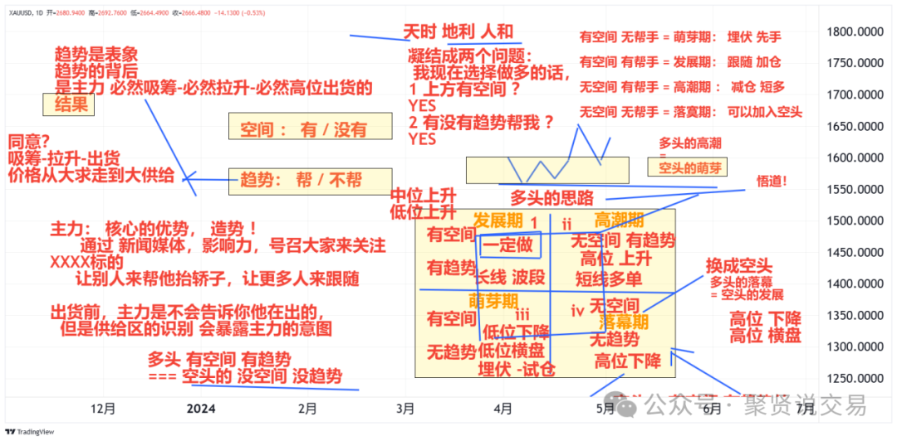

---

## 二、买股票前需要考虑的问题

- 1、如何选股票，有上涨空间吗，评估一下，买进上涨的空间够不够利润，盈亏比如何
- 2、股票的走势特征能不能看懂，在支撑位置吗，找支撑，多少钱买，分析在支撑位置股价向上的概率高还是向下的概率高，优先考虑买点清晰的
- 3、有买点启动信号吗，至少两个买点启动信号，机会提示信号和确认信号，跌到支撑位置，分析能不能涨，K线的几个买点信号，解决起涨确认的问题，有没有放量，放量最佳，个股对应的板块怎么样，优先做强势一点的板块，大盘怎么样，仓位如何控制
- 4、空间盈亏比如何，看小周期有没有结构压力，有压力不可冒进
- 5、怎么持仓，怎么拿得住，持仓的标准是什么，目标位在哪里，到压力位置怎么处理，有没有提前转折的信号，风险提示信号和风险确认信号
- 6、设置好止盈止损了吗，有清晰止损位置的股票可以优先考虑
- 7、大单边上涨和震荡上涨哪个对未来更有利，震荡上涨积累的筹码多，所以对未来上涨支撑力度大
- 8、剩下的交给执行力
- 空间测算：告诉我们起涨的目标位
- 持仓技术：告诉我们万一不到目标位，提前转折出现了风险信号，我们如何应对

### 复盘总结

- 1、这个股票你选的理由是什么？（你也要复盘，用所学的知识，搞明白为什么他会进入股票池。）
- 2、他的技术走势特征和趋势状态是什么样的？
- 3、他的最近上涨是不是在支撑位置启动的上涨？
- 4、入场的信号都有哪些？【这个股票】支撑位置的入场是什么信号？启动以后你追涨了，用的是什么追涨技术？
- 5、入场以后市场调整了，你按什么标准拿得住了这个股票利润。

---

## 三、趋势分析

> 模型形态结构的叠加和堆砌形成了趋势，一波形态结构只会产生一波波段利润，分析K线容易乱花渐欲迷人眼，识别市场价格运行的轨迹，在途径的位置停靠点等着就行，市场力度的强弱也会影响价格的走势，有的可能没有到达停靠位置而提前运行，70%以上的都有规律可循

- 模型结构看市场变化：抓大放小，透过复杂的表象，看到影响价格变化的核心走势，把握高概率的走势特征

### 模型的叠加，依附于趋势，趋势的加速器

#### 上涨

底比底高，顶比顶高

- 上涨延续阶段
- **上涨风险阶段**
  - 上涨趋势中出现下跌ABCD结构，但是还未跌到前期上涨ABCD的低点，可以先卖出，等跌到低点时，可以考虑平底启动模型，但是还要考虑下跌ABCD的压力
  - 上涨趋势直接跌破前期上涨ABCD结构的低点

#### 下跌

底比底低，顶比顶低

- 下跌延续阶段
- 下跌风险阶段

- 横盘：中枢

- 完整的趋势=转折底部形态（有筑底特征）+多个上涨中继形态+见顶形态

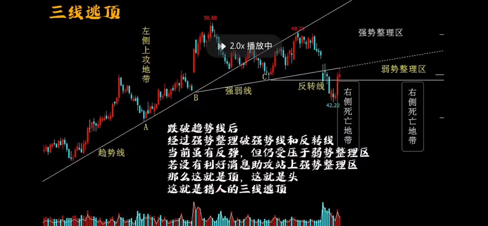

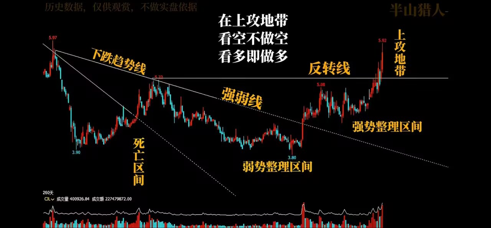

- **筑底模型以后如果形成了下跌走势，当前正在走的模型还被前期的下跌趋势受制着，不要选这样的1+1模型，如果突破不了，很容易形成新的下跌走势**
  - 1+1模型顺势要过筑底的高

### 趋势的前世今生（价格运行的规律）

#### 一、趋势的原始模型

上升趋势和下跌趋势的形成

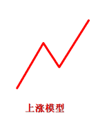

- **市场首次出现上涨模型，称之为上涨雏形，上涨模型寻找机会，下跌模型寻找风险**
  - **上涨雏形形成的意义**
    - （1）说明目前具有了上涨的初步动能
    - （2）C点有重要的支撑位置，上涨雏形的最后一个防守，在上升趋势中支撑力度最强，因为上升趋势可能存在多个上涨模型，首个上涨模型的支撑意义最大
  - **下跌雏形形成的意义**
    - （1）说明目前具有了下跌风险的初步动能
    - （2）C点具有重要的压力作用，未来不能突破C点，不考虑重仓入场的同时且需要注意卖点的风险
- 备注：有上涨模型，不一定会立马形成上升趋势，未来也不一定能形成上升趋势，但只要是上升趋势，就一定有上涨模型

- **二、趋势的转折（机会信号）：先有下跌走势，后不再延续下跌，吸引了看涨情绪的资金逐渐入场**
  - 筑底特征：指前期有走势形态终结掉了原先的下跌趋势
  - **转折过高模型（多空力量转换，多头开始发力，空间也被打开）**

    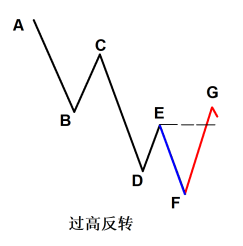

    - **3种力度**
      - **选股选这种强势走势的，未来的上涨空间已经被打开了，力度最强，目标位看向游2**

        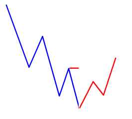

      - **力度次之**

        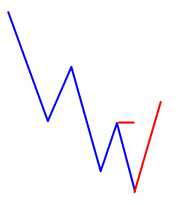

      - **力度最弱，可能受平顶的压力而上不去**

        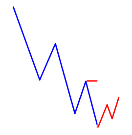

  - **中枢反转模型，必须过中枢的最高点**

    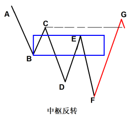

  - **底部ABCD模型，AD的上涨至少达到5A的游资雷区，最好是ABCD模型过5**

    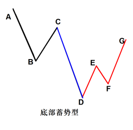

  - **大横盘震荡向上突破，横盘的区间始终以最新的最高点和最低点去画，代表上涨空间打开**

    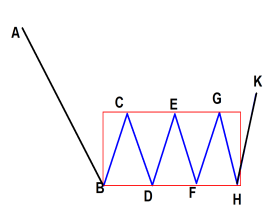

  - **游资擒龙**

    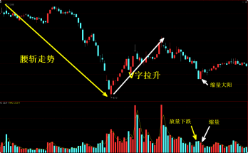

  - 在大周期判断趋势的转折，在小周期判断买点的成立
- **三、趋势延续过程中的调整：行情走势的演变，顺势推动和平底推动是调整的第一关卡**

  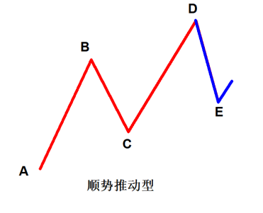

    - （1）ABCD形成上涨雏形走势结构
    - （2）DE下跌在CD的【潜2】支撑位置止跌推动起涨

  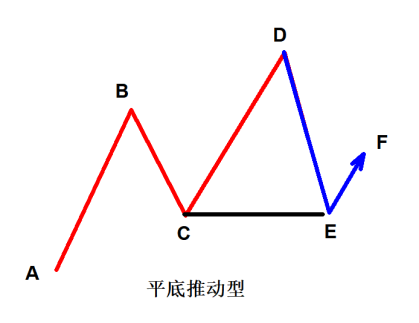

    - （1）ABCD形成上涨雏形走势结构
    - （2）DE下跌在C点支撑位置止跌推动起涨
    - （3）平底推动型需要注意：由于DE下跌幅度偏深，所以DE的【游2】压力要注意是第一目标点
  - **顺势上涨模型**
    - **整波结构模型（收益25%~30%）**

      

    - **上涨中枢（收益在20%），突破中枢最高点，然后提供了强支撑，上涨中枢只考虑支撑，下降中枢只考虑压力**

      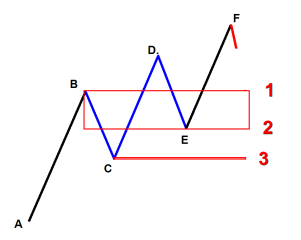

    - **平底启动（收益15%~20%）**

      

    - **顺势推动（既可以加速，又可以深调，成功概率偏低，出现次数偏多），前提是有一波完整的ABCD上升结构**

      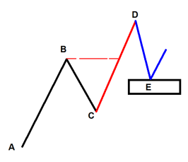

- **四、趋势的调整（风险信号）：1、什么样的股票，你要放弃；2、什么样的股票，你要卖出；3、什么样的股票，坚决不能选**

  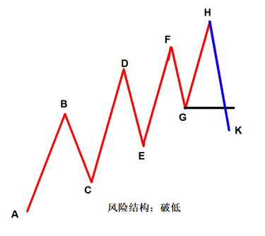

    - （1）ABCDEFGH是一个上涨的稳定推动型走势
    - （2）HK的下跌跌破了G的支撑，破坏了AH以来的上涨走势，说明上升趋势遭遇风险
    - （3）HK破位点G的支撑，目标则是向下寻找新的支撑（AH的潜2, AH内部走势的中枢支支撑或平底支撑）
    - （4）由于HK的破位下跌，未来HK的【游2】则有强压，要提防市场不能突破【游2】压力，由调整发展成反转向下的走势

  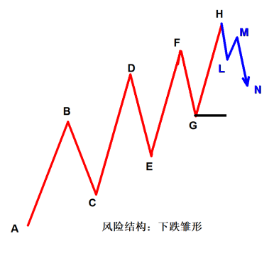

    - （1）AH为上涨的走势趋势，HLMN形成了内部的下跌走势雏形
    - （2）当出现这样的走势模型时，需要提防HN的下跌目标较深，通常G的位置为第一目标

  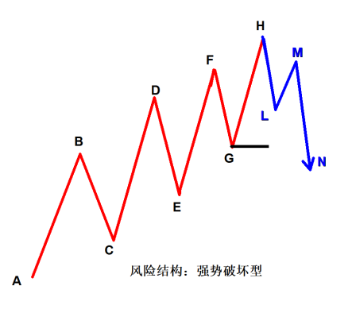

    - （1）AH为上涨的走势趋势，HLMN的下跌雏形形成且同时跌破了G的支撑
    - （2）此走势为强势破坏型，要多注意未来上升趋势遭遇深度调整的概率加大
  - 市场运行路线图，遇到上方3个风险信号后，潜龙在渊的第二支撑位不一定撑得住，要寻找大支撑的位置，下跌力度强小支撑不一定能撑得住，要寻找强势支撑位置
  - 价格出现调整信号，不代表趋势一泻千里，不一定意味着趋势出现彻底性的反转下跌，而是说市场的调整将迎来重要的深度空间，在下一个强支撑位置逮一波机会
  - 上涨抓买点和选股，下跌找卖点和风险信号，宁可顺势打止损，绝不可做逆势单
  - 风险信号是机会产生的关键，追涨风险很大，但是形成了调整，那此时距离逢低吸纳的位置越来越近，下跌结束了，上涨机会就要开始了
  - 下降中枢，跌破中枢最低点，然后形成强压，随后突破下降中枢最高点，形成行情反转
  - 备注：强势破坏型对未来行情继续下跌的影响力度>破低>下跌雏形，力度越大，下跌空间越大，未来反弹所形成的压力越强

#### 趋势的延续和调整深层理解

- 1、跌破临近支撑，不代表趋势转折，只是说明价格要朝向更大的下跌空间运行
- 2、更大的支撑，如果有止跌依然有交易机会
- **3、极限支撑的破位，则选择放弃；【自上而下看3层支撑】**
  - **(1)第一层：临近波段潜龙在渊2号位和平底支撑**

    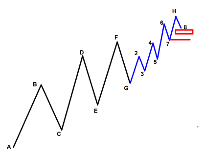

  - **(2)第二层：主波段潜龙在渊2号位和平底支撑**

    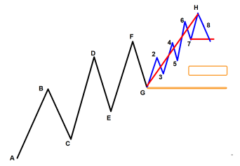

  - **(3)第三层：主趋势的潜龙在渊2号位**

    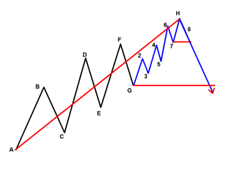

- 转折模型是距离顺势上涨模型最近的一个模型，所以我们要关注底部转折模型，底部转折失败了，会重新回到顺势下跌模型，底部转折成功了，会走入顺势上涨模型，刚进入顺势上涨模型，未来的上涨空间会更大，不要等到涨的高了再去做

- 庄家吸筹需要钱，拉升也需要钱，拉升到高位在高位出货做头部也需要钱维稳
- 市场行情突破压力的逻辑，达到压力位置回调不破前期低点，说明主力还想拉升股票，否则就是主力出货了，这对选股和持仓的分析有帮助，主力在不断的提升低点，说明主力还在，一个股票前期有压力位，在达到压力位回调时不破前期低点，又接着往上推并创前期高点新高，二次达到压力位，回调不破近期低点又往上推，这样的股票未来有机会，这样的回调在不断的洗掉不坚定的散户，并拿到价格相对低位的筹码，主力又更多吃货，未来拉升的动力会更强，价格达到前期压力位置下跌是很正常的事情，在支撑位置不破会继续往上推

---

## 四、选股策略

> 筑底特征+高概率模型，选择未来有上涨空间，有潜力的股票，突破的级别越大，未来的空间越大，大波段突破为主，模型结构思维告诉我们要抓大放小，重点选择有空间的股票，行情告诉我们能做，在支撑位置，买点才去考虑细节，买点环节抠细节，选股环节选空间

选股关键词：**筑底完成、进入顺势、没有大涨过。** 三种打法：游资擒龙（短线）/ 1+1 高概率模型（波段）/ 主力擒牛（形态+量能+筹码+位置+预期）。

- 总则：板块比大盘强，有一定的赚钱效应，当前的板块行情走势没有风险，就可以跳过板块选个股

### 先分析大盘

通过大盘环境明确交易主要策略

#### 大盘稳定向上

仓位放大60%+、买点激进、波段为主

- 如何判断大盘稳定向上：大盘出现起涨信号（如横盘突破）后，还没有出现风险信号；市场行情出现上涨，还没有见顶
- **买点激进怎么做**
  - 追涨型买点，不用等回落，看小周期结构入场
  - 埋伏型买点：到位就买
  - 确认型买点：顾比、包含、形态ABCD、横盘突破
- 波段指的是持仓空间和利润

- **大盘震荡：放弃大盘，关注强势板块**
  - 大盘震荡核心是有的票上涨，有的票下跌，板块轮动快，分歧大，此时应关注强势板块
- 大盘调整：轻仓或空仓

- **再分析板块，板块决定是否有赚钱效应，找强势板块，板块是观测钱在哪里，在支撑位置附近，对热点的捕捉具有及时性，板块没有见顶前，都可以做**
  - **大盘对比法（适合大盘调整的情况选择强势板块）：ZSDB，对比板块和大盘的走势，寻找以前走势强于大盘的，而不是现在强势，现在强势很容易追高被套，等回调到支撑位置**
    - **大盘下跌，板块横盘，板块震荡上涨，但不能大涨**

      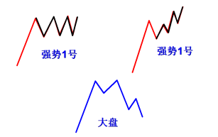

    - **大盘破位，板块不破位**

      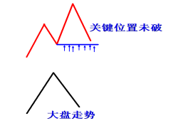

    - 大盘上涨，板块横盘，适合赚了指数不赚钱的行情
  - **走势模型分析法（适合大盘上涨的情况）：板块结构支撑**
    - **寻找刚在支撑位置启动的板块**

      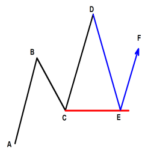

      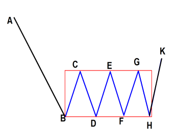

    - **寻找快要跌到支撑位置的板块**

      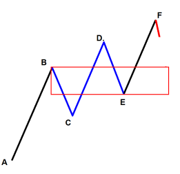

  - **三类板块**
    - 最好的板块：刚好在支撑位置，有更大上涨空间的板块为首选，在支撑位置止跌启动了，就可以找该板块下的个股【伴随启动，抓大利润】
    - 稍微差一点：板块走势走的是顺势推动和稳定上涨的特征，且没有风险信号，板块未见顶【有赚钱效应】【跟随热点，做补涨行情】，选高位板块，但不会选高位票
    - 当前板块走势比大盘强，有赚钱效应，并且没有风险信号，就可以找该板块下的个股
  - **找出来好几个强势板块，然后分析技术走势，优选**
    - **上升趋势优选**
      - 适合短线操作和顺势操作
    - **支撑位置启动的优选**
      - 适合波段操作
    - 有短期买点的优选，比如横盘突破
  - **要点**
    - 大盘在上涨时，使用走势模型分析法和上升趋势选择强势板块
    - 大盘在调整时，使用指数对比选择强势板块
  - 板块启动也是赛马法逐步成为热点，看热点持续性和衰退型，板块热点不具备预测性，形成热点前，一定是涨过一波的，所以我们运用所学的知识，更好的发现热点在启动之初的位置，板块一直涨，板块内的股票是轮番上涨的，个股是接力赛

### 后分析个股

- 1、借周期势，优先选择周线有上涨模型的股票，空间更大且安全，选取有明显上涨和调整波段的上涨结构，周线横盘的，直线拉升并且在日线中进行游资确认的不做
- 2、借板块势，以上的分析方法
- **3、分析做短线还是波段，还要结合市场行情，市场行情不好，下跌或横盘调整时一律做短线**
  - 1、浅调支撑：当前级别的临近支撑和平底支撑【短线和顺势单】
  - 2、深调支撑：更大级别的临近支撑和平底支撑【波段单】
  - 3、极限支撑：趋势走势的临近支撑【大波段单】
- 4、选择市场有大趋势的顺势ABCD
- 5、下跌趋势被上涨突破压力的

#### 重点关注3类个股

- 有买点启动信号的
- 成交量有放量，异动
- 大阳放量，调整缩量

### 两种模式选股

- 1、涨幅排行榜，选取的股票是最近已经启动了，属于追涨型入场技术
- 2、跌幅排行榜，选取的股票是距离支撑位置比较近的股票，必须符合1+1模型，且价格没有经过长期上涨或者单边连续涨停上涨

### 异动选股

- 1、借助周期势，板块势的优选，首先要选择热点板块
- 1、选择涨幅在3%~7%的股票
- 2、剔除掉量比小于1，成交金额小于1亿，换手率小于3%和大于15%的股票
- 3、选择流通市值在50亿到200亿之间的股票，可选项
- 4、然后根据成交金额从大到小排序，选择符合五大高概率模型的股票
- 5、尽量选择均线5日，10日，20日，60日向上发散的股票，但离均线位置不要太远
- 选择筑底模型+顺势模型+没有大涨过的股票
- **第一梯队：要求他的当下起涨，有支撑位置或者距离支撑位置比较近，当下重点值得关注的；【筑底模型+顺势模型+买点信号（主力异动）】**
  - **主力异动信号有**
    - 横盘蓄势型
    - 大阳不破护盘型
- 第二梯队：未来值得关注，但是当下还没有起涨的，距离支撑位置较近【筑底模型+顺势模型】
- 第三梯队：未来值得关注，但是当下还没有起涨的，距离支撑位置较远【筑底模型+顺势模型】

### 股票池的建立技巧

- 1、复盘当日涨停票，发现市场热点
- 2、复盘当日涨幅在4%~7%之间的票
- **板块或个股最近出现异动，开始追踪，板块出现异动，开始选股，个股出现异动，开始关注，准备资金，异动后再次出现启动信号，开始入场**
  - 1、走坏的要出掉
  - 2、完成上涨的要出掉
  - 3、出掉弱势股，准备调仓
  - 异动+追踪关注，确认上涨势能+再次出现启动信号入场

#### 认知

- 1、大盘有上涨空间，板块有上涨空间，挑选有上涨空间的个股【中期大波段票】
- 2、大盘有上涨空间，挑选有上涨空间的个股【短线票】有钱挣就可以了，没有也别自我否定。持有利润以后，继续观察发展有没有更大的机会
- 3、板块不理想，个股有上涨空间【持续性差，风险高】
- 4、大盘不理想，个股有上涨空间【持续性差，风险高】
- 5、大盘不理想，板块有上涨空间，抛弃大盘做个股，但是要谨慎一层，控制好仓位【短线+小波段】
- **应对市场要建立的股票逻辑**
  - 1、如果你的资金充足，或者你想轻松做一些股票，就选【中期大波段票】
  - 2、板块走势不错，但是目前大盘环境不好，此时挑选板块内的票做小波段
  - 3、大盘最近不错，板块并不理想，做个票的时候，优先考虑短线为主
  - 4、大盘环境好，板块环境好，个股有上涨空间，3分，仓位可以重一些
  - 5、大盘环境好，板块环境不好，个股有上涨空间，2分
  - 6、大盘环境不好，板块环境好，个股有上涨空间，2分
  - 7、大盘环境不好，板块环境不好，个股有上涨空间，1分

### 选股标准

- **选股的核心：通过以前的走势特征，来识别未来有机会的一件事**
  - 关键词：1、筑底完成；2、进入顺势；3、没有大涨过；

#### 游资擒龙选股：短线票

- **走势特征**
  - **1、不能经过长期上涨，最好是下跌腰斩的票**
    - 腰斩的股票，说明里面没有庄家控盘
  - **2、底部第一波启动，V字启动最好（直接从下跌转为上涨拉升）。【游资V字启动（涨停第一因子）；长庄横盘启动】**
    - 震荡拉升：长庄
    - V字拉升：多为游资短庄
  - 3、天量天价之后开始回落，量能变化：整体为缩量
  - **4、缩量的内部阴量的变化：先放量阴，然后再缩量阴**
    - 高位顶点放量阴：说明主力出逃，预防还要下跌
    - 低位或下跌一段以后，再放量阴：市场散户大范围割肉，逼空行情出现，价格随时容易见底
  - **5、底部出现特征：不放量收出大阳线，中阳也可以**
    - 缩量：说明拉升所需要的资金少
    - 大阳：主力的行为
- 放量下跌还要跌，此位置是上涨了一段时间，价格还在高位的情况，价格开始调整，已经下跌了一段时间，再次出现放量阴，距离底部会越来越近，不一定立马见底，看是否出现了阳线，放量阴没有确认阳线时底部是出不来的
- **实操（符合条件的加入股票池）**
  - 1、复盘当日涨幅在4%~7%之间的票
  - **2、强势行业板块中，在板块启动之前，或在板块刚刚启动时，选择个股**
    - 寻找异动的板块，观察确认，启动信号入场

- **1+1高概率模型选股：波段票，中长线票**
  - 选择横盘的优于已经大涨的，横盘是蓄势，一旦向上突破，未来上涨潜力大
- **主力擒牛选股：形态，量能，金额，筹码，位置，预期(催化剂上涨理由)，满足以上六点，买点出现，可以试仓**
  - 重点关注换手率
  - 成交量要增加，最好有倍量
  - 月周日共振密集
  - 低吸为主

#### 常见问题

- **1、有多个强势股，如何选择更强的**
  - **1、先看板块，强势的板块，优选以下符合条件的个股**
    - （1）横盘的，优于单边起涨的
    - （2）有明确护盘力量的，优于没有出现护盘力量的。买点清晰，止损设置清楚
    - **（3）**

      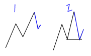

      - 1和2对比，2的支撑是最后一个支撑防守。如果要启动，就只能在这里启动。一旦跌破平底支撑，未来容易有更大的下跌空间
    - （4）价格在支撑位置，启动买点，更加干净利索。【快速突破必然比慢速突破买点更提前】
  - **2、对于弱势的板块，优选以下符合条件的个股**
    - （1）板块弱势的股票，我们不做1买；【跌倒支撑位置的买点】
    - **（2）板块弱，我们只考虑两种，做2买**
      - 横盘蓄势
      - 护盘力量（有可能炒作的不是你看见的板块，而是某个概念。

#### 波段票以及大波段票选股，底是跌出来的

- 市场具有规律的3个类型：整波潜2，平底启动，顺势启动
- 启动之前都有一个比较重要的下跌，从下跌走势中挖掘已经接近支撑的票，下跌有一定时长，不能是跌停板下跌
- 20日跌幅
- 60日跌幅
- **选择什么票**
  - 股票有筑底特征，未来的空间更容易产生
  - 横盘突破的股票，上涨空间打开
  - 并结合整波潜2，平底启动，顺势启动
  - 大涨后的票不要
  - 周线上选顺势启动，平底启动，整波潜2

---

## 五、买点位置

> 价格永远朝向阻力最小的方向运行，找支撑和压力，支撑找买点，压力找卖点，所有的压力和支撑只看第一次，支撑达到的次数越多，支撑越有效，但是对于买点只有第一次有效

### 结构支撑

- **平底启动支撑**

  

- **上涨中枢支撑**

  

- **横盘震荡支撑**

  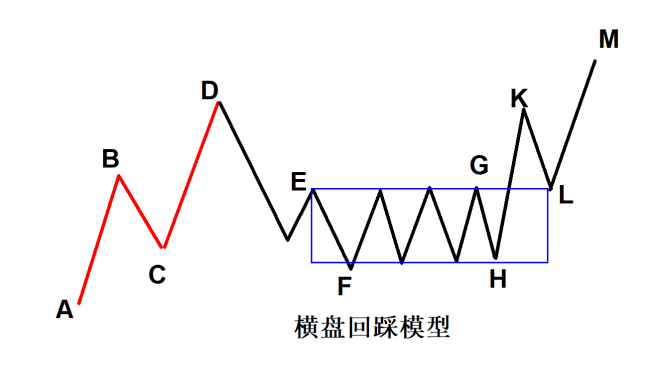

### 测算支撑

#### 转折过高模型支撑

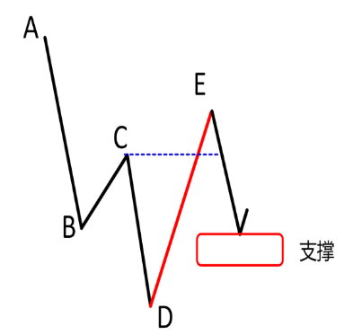

- 因为DE段的强势，回调下来后容易产生一波反弹，反弹的上涨是由于DE段强势诱发出来的反弹行情，一旦反弹，就代表该模型结束了，形成了一个闭环，至于能反弹多高，他是后市价格发展延续引申出来的，他可以受制于游资第二雷区结束上涨，也可以形成新的上涨模型

- **转折过中枢模型支撑**

  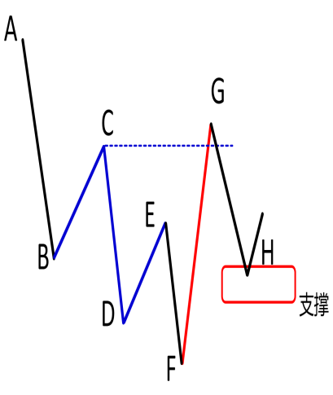

- **顺势推动模型**

  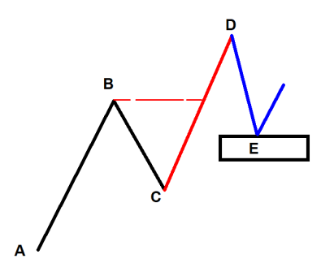

- **整波模型**

  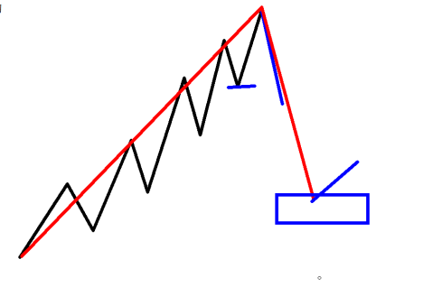

- 筑底模型后会产生一波波段操作机会，上涨中枢后会产生一波波段操作机会，一个模型管一波，一波形态结构只会产生一波波段利润

### 两种买点

- 追涨式买点：过掉前高，形成新的ABCD结构或者其他模型结构，回落下来寻找机会
- 回调式买点：找已经形成的ABCD结构的支撑位置或者其他模型结构的支撑位置，然后寻找买点
- 无论追涨式买点还是回调式买点，都不会追高
- 市场在调整时，有可能直接涨，直接涨要突破小周期的下跌走势压力，也有可能回调涨，回到潜2的位置
- 两次上车机会，如果选择回落，一次是回调到支撑位置不破位，如果不选择回落，另一次是不回调站稳高点
- 空中加油买点，对于短线，回到小时周期，找潜龙在渊的位置

#### 回踩买点

- **回踩的是什么**
  - 在支撑位置启动的买点，价格未完全形成大范围的拉升空间

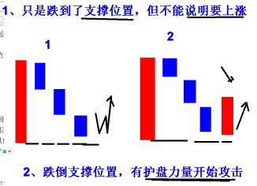

#### 什么情况下，可以追涨，否则只能做低吸

- 1、大盘环境不错
- 2、板块走势状态良好
- 3、此类型回踩低吸买点，距离启动支撑位置不远
- 4、放量大阳，最好是突破最近成交量的高点

#### 交易如何做到进可攻，退可守

- 如果没有跌到支撑位置，直接启动了，要过掉前期的压力位才能入场
- 如果跌到支撑位了，出现买点信号后入场

- 市场就两种走势，要么先调后涨，调到最近波段的潜2，目标看最近的下跌走势的高点，要么先涨后调，达到最近的高点，调到潜2看更大的空间

### 价格运行的规律，阻力分割空间：支撑和压力

- 混沌理论提出：价格永远朝向阻力最小的方向运行。
- 下跌的目标是支撑位置，上涨的目标是压力位置
- 支撑位置：市场向上的推力大于向下的推力，价格朝向阻力最小的方向运行，容易形成发生向上的转折，跌破支撑，容易有更大下跌
- 压力位置：压力位置向下的推力大于向上的推力，则市场容易发生向下的转折，突破压力，容易有更大上涨
- 到压力位置，调整的方式有下跌调整，有横盘调整，再次出现买点信号时才能入场，有些行情比较强势，有大盘的配合和情绪题材的配合，可能直接突破压力位，但再一再二，不可能再三再四，等回调下来还有机会做
- 寻找支撑和压力要找临近波段的，前期的支撑和压力被穿越过，就不做重点考虑了

#### 阻力分割顺序

- 1、临近【潜2】
- 2、平底支撑
- 3、整波潜2与大级别平底

- 事出反常必有妖：该破不破与不该破反破之间的强弱变化

### 支撑区域买入的优势

- 稳定性强，准确度高
- 风险可控，止损空间小
- 交易方法灵活，分仓布局更加具有优势

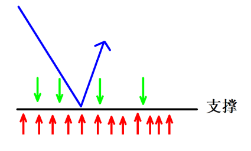

#### 关键要点

- 抓大放小，把握核心支撑
- 共振支撑强于单独支撑

### 波段的划分

- 同级别的波段指：波段时间和波段空间相差不大
- 波段的合并是合并同级别的波段，当前级别被跌破后，寻找更大级别的支撑

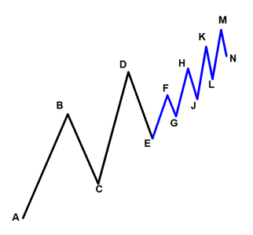

- 1、浅调支撑：当前级别的临近支撑和平底支撑，LM的潜龙在渊2的支撑和L的平底支撑，做小短线
- 2、深调支撑：更大级别的临近支撑和平底支撑，EM的潜龙在渊2的支撑和E的平底支撑，做小波段
- 3、极限支撑：趋势走势的临近支撑，AM的潜龙在渊2的支撑，做大波段

### 关键要点

- 抓大放小，把握核心支撑，学会抓大波段的支撑，放弃小波段形成的支撑
- 共振支撑强于单独支撑
- 临近第一个支撑被跌破以后，下一个支撑的启动概率会更高

---

## 六、起涨确认

> 本质是通过牺牲一段行情的走势，来判断价格起涨的安全度，牺牲的走势越大，上涨的力度也越大，牺牲的走势越小，上涨的力度也越小

| 级别 | 适用 | 代表 | 优劣势 |
|------|------|------|--------|
| 一级启动 | 顺势、买在支撑、大周期 | 顾比 K 线、核心 K 线、埋伏型 | 灵敏、出现多；稳定性差 |
| 二级启动 | 深回落、不安全行情 | ABCD / 中枢 / 横盘突破、周线确认 | 稳、准、少；灵敏度差，易踏空 |

三类买点：万金油（顾比） / 追涨型（五大核心 K 线） / ABCD 结构。

### 一级启动信号

适用于顺势行情，安全的行情

#### 适用于

- 1、上升趋势
- 2、买在支撑点
- 3、在大周期使用

#### 确认型买点

- **顾比K线买点：一定要看完整的3根K线，价格在强支撑位置，尽量选择顾比K线起涨确认，考虑上涨力度是强是弱，万金油买点，不挑行情**
  - **快速启动**
    - **突破以后，现价买，参考以损定量方式，轻仓入场；（如果出现涨停，不要追涨，涨停代表市场力度极强的表现，价格容易出现物极必反，否极泰来的情况）**

      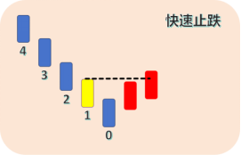

    - 突破以后等回落，再次出现买点时买进。（价格中阳突破10日线买点；市场回落突破顾比也可以入场；回落目标位注意最好不跌破临近的潜2）
  - **慢速启动**
    - **突破以后等回落，再次出现买点时买进。（价格中阳突破10日线买点；市场回落突破顾比也可以入场；回落目标位注意最好不跌破临近的潜2）**

      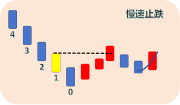

  - 顾比K线突破以后没有回落，而是小阴小阳的横盘，此时就放弃中阳上穿10日线，小横盘突破就是买点
  - 分仓买入，不打止损不卖出
  - **顾比突破入场细节**
    - **1、尾盘入场法：当日价格中阳突破10日线后，可以在当天尾盘的最后15分钟入场（2:45），避免明天价格出现风险，我们出不来**
      - 初级交易者：不触碰止损位，不卖
      - 中级交易者：行情没有走坏，我不卖
    - **2、次日低位入场法**
      - （1）次日开盘即可入场
      - （2）分时入场技巧，回到分时寻找结构（短线交易技巧）
    - 以损定量控制交易风险
    - 必须有的交易思维：永远买不在最低点，我们挣的是机会形成以后的空间
  - **有两种及以上进攻信号所产生的入场点更稳健，如：顾比K线快速突破后，再有中阳的上涨信号**
    - 一根大阳中阳线提示机会信号，再次出现确认机会信号
- **核心K线买点：价格经历了顾比K线，已经脱离了底部，并且没有大涨的情况下，可以选择核心K线买点启动，可以用作追涨型买点，追涨型买点也是等回落后再次出现买点信号再入，回落幅度可能不会太深，如果再次出现核心K线买点信号即可入场**
  - **强弱关系看K线**
    - 中阳、大阳线：强势且有主力的参与
    - 中阴、大阴线：弱势且有主力的参与
  - **大阳反包实体：二次启动买点**

    

  - **大阳反包长上影：见底后的回调买点**
    - **长上影是主力在拉升前的试盘行为，洗掉不坚定的散户，一般这个买点出现在见底后的回落买点**

      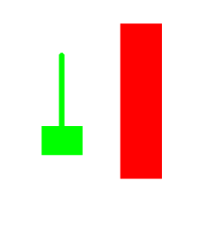

  - **大阳反包十字星，可以用在支撑位置**
    - **十字星可能会扎堆出现，以这段行情十字星的最高价为向上突破，以最低价为向下跌破，合并这个区域**

      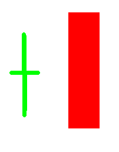

  - **大阳后回踩最低价：K线实体至少5%以上，可以用在支撑位置**
    - **大阳线最低价是最后的防守，回调不要求必须踩大阳线最低价支撑，一旦在大阳线后再次出现买点信号可以买入**

      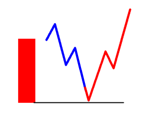

  - **大阳突破小横盘震荡**

    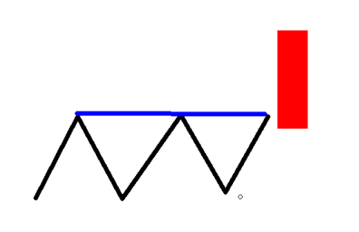

    - **一字型横盘，突破即为买点**
      - 没有明显的波段划分，价格由小阳和小阴为主要构成部分
    - **波段型横盘**
      - 有明显的波段构成，但波段空间通常不大，会维持在10根左右的K线形成的横盘震荡
      - **此类横盘突破以后，价格通常有2种走势特征**
        - 突破之后直接启动
        - 突破以后，进行回踩然后启动
      - 针对这类的横盘突破，最好的形式就是以损定量入场
  - 大阳中阳反包大阴中阴的本质是：昨日有空方主力的看跌动作，当前的下跌力度比较强，今日又有多头主力击溃了昨日空头主力，上涨力度比较强
  - **有主力行为，且形成下跌，说明有两种情况：1、洗盘；2、出货，我们无法判断主力是洗盘还是出货，只能通过K线的强弱关系区论证，还要结合位置去判断**
    - 价格能过前高，次日反包说明洗盘
    - 价格不能过前高，次日下跌说明出货
  - 尽量一根阳线以内反包，代表市场力度强

#### 埋伏型买点

- 上方没有压力，没有明显的风险信号
- 下方在支撑位置，小周期灵敏的买点启动信号
- 跟上止损的重要性

- 回到大周期，让稳定性提高起来
- 优势：灵敏度高，会频繁出现买点信号；劣势：稳定性差，准确性差

#### 备注

- **只有一种进攻产生的入场点：顾比K线买点信号**
  - 优势：可以拿到更多的利润
  - 缺点：相对来说没有那么安全
- **两种进攻走势，所产生的入场点：顾比K线买点信号+新的买点信号，两种进攻走势产生的入场点**
  - 优势：更安全
  - 缺点：错过一些利润

- 顾比K线买点在前，追涨型买点在后，如果两种买点信号都进了仓位，在以后达到压力位后先减掉追涨型买点的仓位

- **二级启动信号：适用于深度回落的行情，市场不安全的行情【形态类买点，最终也会回到K线买点信号中】**
  - **ABCD结构**

    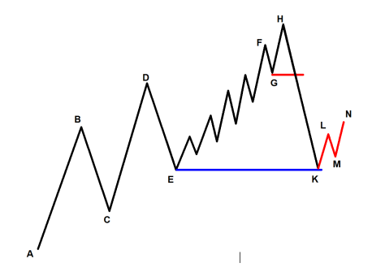

  - **中枢结构**

    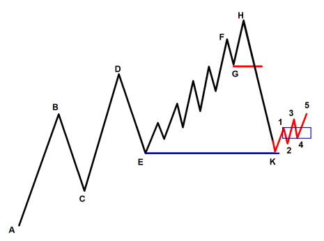

  - **横盘整理突破**

    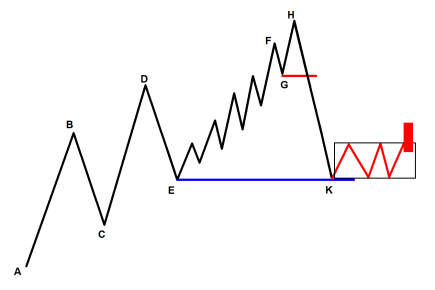

  - 周线出现买点信号，适用于回落较深的行情，并结合日线形成形态买点信号
  - 长时间的下跌，需要在周线上确认起涨信号，空间的打开，比如顾比，比如横盘突破，如果周线上顾比K线较远，可以考虑日线的形态止跌，识别下跌的终结
  - 背离技术
  - 优势：稳定性高，准确性高，出现次数少；劣势：灵敏度差
  - 回到小周期，让灵敏度提高起来

### 一级止跌和形态止跌的优劣势

#### 一级止跌更加灵敏但准确度低，更适合

- 顺势的支撑位置
- 半山腰使用，稳定性差

- **二级止跌相对来说滞后，通常利润会被压缩，但准确度高。通常适用**
  - 深度下跌或下跌趋势的终结
  - 悬空启动的确认
  - 小周期的灵敏性配合二级止跌的稳定性
  - 过渡使用二级止跌，会导致踏空

- 买进卖出的时候关注核心K线，行情到达关键的位置关注核心K线，在没有到达关键位置的时候，我们关注形态结构，不必太在意K线的涨跌，忽略日内价格的波动，只关注关键位置的核心K线即可，不容易被虚假的K线信号骗现，不是所有的K线都有分析意义，重点关注突破型K线，关注他的力度
- 起涨确认信号出现以后，如果你觉得这个时候涨了一小段，离支撑位置有点距离，比如形态止跌买点信号ABCD结构，你可以等D点回落再次出现买点信号后入场，再比如在支撑位置涨了十个点乃至更多，等回落再次出现买点信号后入场，此时可以激进一点，有买点信号就进，因为前期已经出现了买点启动信号了，不用重复性的验证买点信号，等回落就是不用买在小波段的高点，买进以后是为了以后的波段空间

### 买进以前要有的思维

- 1、有买点信号就只管买，跟上止损，不要试图买在最低点，越犹豫他越涨，最后得不偿失

#### 2、以损定量来限制入场的手数

- **适用环境**
  - 1、以止损的多少来衡量入场的数量（金额）
  - 2、价格已经出现了入场信号，但是风险比较大，不确定能不能入场
  - 3、市场存在两面性概率较高。（即可以直接涨，也会出现回落型买点）

- 3、行情涨起来以后，追涨买入时先问自己止损空间能不能接受

### 买进以后要有的策略思维

- 1、盯盘的过程中，你会不自觉的看到阴线会去想：价格是不是走坏了，我有没有必要走掉；
- 2、买进以后，不要以风险信号为卖出点；此时在支撑位置，不要卖在了起涨以前
- 3、跟上止损，不要盯盘。越盯盘，越容易内心不静，然后卖飞票；

#### 我们做的已经是大概率事件

- (1)选票，我们会过滤有价值的股票；
- (2)选择市场强支撑位置，去入场；
- (3)有明确启动信号，才入场；
- 买进以后，交给市场，不触碰止损不卖出，要有定力；
- 买进以后，不到目标，不减仓；此时就不会错过波段核心利润

- **不要妄想买在最低点，也不要妄想着买进以后立马就上涨，也不要妄想着买进以后不让回调，因为有3点原因**
  - 大阳买进以后，小分时已经出现在高位了，有回调的需求
  - 买进以前，行情由于前期长期下跌蕴含的空头情绪比较重，行情下跌走势的干扰，虽然在支撑位置，此时多头是疲软的，在上升过程中，有回调的需求
  - 技术在牛，买进以后也不可能立即形成大涨
- 盈亏同源，不打止损不卖出，你有可能亏损的更多，但以后上涨，你也会错过大的波段利润，至于怎么做，要看你自己

- 涨起来以后能不能做的核心不是买点技术，这个时候买点技术已经不重要了，重要的是抗风险能力，因为离买点位置已经很远了，追高对买点技术没有过高的要求，追高的核心是价格走顺势，我利用可控防守去赌注，设置好止损

### 三类买点

- 万金油买点，顾比K线
- 追涨型买点：特殊类型的5大买点，作为追涨买点
- ABCD结构买点

---

## 七、空间盈亏比

| 盈亏比 | 做什么 |
|--------|--------|
| 2:1 | 波段交易 |
| 1:1 | 短线交易 |
| 不足 1:1 | 超短线交易 |

目标位顺序：买点启动后看 **游资雷区第二目标**（第一止盈，可减 1/3）→ 突破后再看 **腾蛟起凤第一目标**（关键利润，可清仓）→ 顺势再破则极限看第二目标。客观压力（游二 / 前高 / 中枢）优先于腾蛟起凤预测。

### 空间是如何产生的

- **分时走势形成单根K线，单根K线形成K线组合，K线组合形成波段，多个波段形成形态，形态到趋势**
  - 单根K线，影响次日分时波动
  - K线组合，影响1-2天波动，影响未来1-2天的价格涨幅
  - 波段走势，影响2-3天波动，影响2-3根K线的空间
  - 形态走势，影响波段利润空间，如果想要赚取波段利润，首先要分析形态，稳定度高，更重要的是能创造出来波段利润空间。因为形成形态，它所需要的成本是最大的，波段能带来40%-50%的利润空间
  - 单根K线，造假成本很低，K线组合，造假成本略有抬高，波段，造假成本更高，形态，没有人愿意去造假，成本太高了
- 趋势就是转折底部形态（W底，头肩底，圆弧底）+ 上涨中继形态（收敛三角形，旗形）+  顶部形态
- 想要做好波段，分析形态很重要，在关键的形态位置止跌上涨，未来容易走出一个波段空间的利润

### 评估盈亏比

#### 买入点位的利润空间和止损空间是否成正比，2:1以上最好

- 1、看买点位置到游资雷区第二位置的盈亏比，到达游资雷区第二位置要做减仓动作，比如1/3，用剩下的资金博弈未来的行情
- 2、如果到达游资第二雷区，形成回调后再次上涨穿过第二雷区，或者是直接穿过第二雷区，那代表新的上涨空间打开，下一个目标位用腾蛟起凤计算，看腾蛟起凤第一目标位，到达后清仓

- 主要看游资雷区的第二目标点和腾蛟起凤的第一目标点，下方的盈利目标，计算盈亏比

#### 如何计算盈亏比

- 1、如果是不是顺势本级别，出现了更大空间的下跌，此时游资雷区压力位要升级，找游资雷区第二目标点计算
- 2、如果是顺势本级别，不考虑当前游二，找更大下跌结构的游二计算，如果当前位置距离大下跌结构还有空间，找腾蛟起凤第一目标位计算
- 3、价格在压力位下方形成横盘，找更大的压力位置计算盈亏比，先考虑临近的腾蛟起凤目标位进行计算

#### 盈亏比判定做什么交易

- **盈亏比2:1**
  - 波段交易
- **盈亏比1:1**
  - 短线交易
- **不足1:1**
  - 超短线交易

### 盈利目标

#### 1、买点启动之后，看游资雷区第二目标点【第一止盈目标】

- 1、顺势本级别买点，不考虑游资雷区压力，只做观测位置，不做空间研判盈利的主目标位，因为我们做的就是顺势单，此时主目标位找当前的上涨有没有遭受更大下跌结构的游资雷区第二压力位，如果当前位置到更大级别的游二还有空间，然后再看临近上涨的腾蛟起凤，先考虑大空间，然后再看腾蛟起凤第一目标位
- **2、升级以后的游资雷区压力要重点关注，级别升级的本质**
  - 比较两个波段下跌调整的时间
  - 比较两个波段下跌调整的空间
- 3、在压力位下方形成横盘走势，横盘是蓄势，压力位未必能压得住，横盘向上突破代表上涨空间的打开，此时上方压力位要退后，找更大的压力位，此时用临近上涨的腾蛟起凤找目标位，计算盈亏比

- 2、游资雷区压力突破后，目标看向腾蛟起凤第一目标【完成此次交易的关键利润】
- 3、补充：若是顺势行情，价格直接突破腾蛟起凤第一目标位，则极限看向第二目标
- 如果完成上述3个目标，则需要找新的模型，因为这个时候已经把上个模型积攒的上涨能量消耗殆尽了
- **注意：在上涨过程中，顺势上涨的腾蛟起凤目标位和更大级别下跌波段的游资雷区压力位出现冲突，通常优先考虑游资雷区压力，只有没有游资雷区压力、平高、中枢压力时才会重点看腾蛟起凤**
  - 1、游资雷区、前高、中枢这些压力是已经客观形成的
  - 2、腾蛟起凤属于力度的预测
  - 先遵从客观存在，再考虑预测

#### 细节梳理

- 1、更大级别的游资雷区压力是目标位
- 2、本级别【小级别】的顺势上涨是为了到达更大的目标位
- **大周期的压力不是必须到，那既然这样，为什么还分析**
  - 1、首先市场一旦起涨，这个位置到达的概率极高
  - 2、市场达到这个压力以后，容易停止上涨，转为下跌，参考意义极高
- **什么条件下，大周期的目标压力，容易到**
  - 1、顺势上涨的走势，变现良好，趋势没有发生转折向下
  - 2、顺势上涨发出了明确的买点启动信号，预示下一轮的上涨开始（我们的入场位）
  - 3、价格破位压力，逐次向更大的空间去看

### 波段的拆分和合并

- 同级别的波段不存在完全包含关系，如12和38段为同级别同量级的波段，核心大波段是1238，36波段在12波段以内，为12波段的调整波段，同级别的波段每一波都会过前高，不同级别的波段还受上一个波段的影响，没有过前高，不属于同一量级，9的位置启动能涨到哪里，运用腾蛟起凤测389，因为9和7是平底，9的调整是针对38的大波段，为什么不用189测呢，因为属于同一级别的从最原始波段测，不属于同一级别的从临近的大波段测，而且9跌的位置不足以用189测

  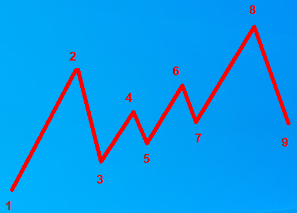

- 12和34和56和78属于同一级别的波段，9的位置启动，应该测量189，同一量级的波段测算应该从最初的波段开始，不同量级的波段测算从临近的大波段开始

  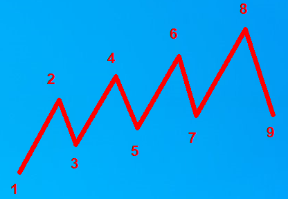

- 顺势启动不破低，不需要合并，直接找3个点计算
- 顺势启动平底启动，顺势启动破低启动，需要合并，找到平底启动前，破底启动前的上个波段合并计算

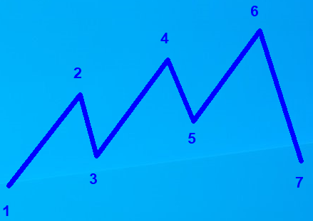

- 67波段的下跌，跌破是表象，核心本质是从空间和时间上来看，和23与45之间波段的调整不在同一个规模上
- 放大一个周期，可以过滤掉看不懂的走势以及选点，一种简单的波段合并的方法

### 如何判断有空间

- 1、当前在不在压力位置，有没有受压力的影响，导致他没有了空间
- 2、上涨的走势，有没有出现走坏的情况
- 3、突破前期压力，回调下来有空间

### 三层压力

- 下跌走势的游二压力和平高压力
- 整波的游二压力，以及与形态结构的共振压力
- 趋势的游二压力
- 压力只看一次，支撑也是

---

## 八、持仓技术

> 核心是控制回撤，本质是寻找风险点和转折信号

- 持仓的关键其实就是寻找合适的出场点，价格在运行过程中遭遇到了风险信号，交易者根据风险信号的大小、强弱来进行合理的减仓、清仓的行为
- 短线的持仓，就必然风险信号偏灵敏
- 波段的持仓，就必然风险信号偏滞后

### 中短线持仓组合

- 1、第一次减仓：长上影、中阴反包、高开低走、顾比，作为一次减仓信号，先把小短线利润做出来
- 2、小波利润：小低点不破位，小形态低点，随着上涨不断上移
- 减仓一两次基本就减完了
- 找到适合自己的持仓标准，持仓非常考虑人性

### 局部持仓核心

学会中短结合，把握核心空间

- 1、短线风险信号为减仓点
- 2、形态，波段风险信号为清仓点

### 风险信号的识别

- **卖点风险信号：先看风险提示信号，再看风险确认信号来减仓卖出**
  - **K线类**
    - **单根K线作为风险提示信号**
      - **长长的上引线**

        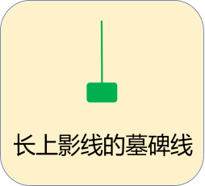

      - **大于3%的实体阴线**

        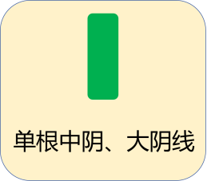

    - **多根K线作为风险的规避减仓信号，风险的确认信号**
      - 大阴反包大阳，中阴反包中阳
      - 大阴中阴线反包长下影，长上影
      - 大阴中阴线跌破横盘
      - 高开低走的中阴大阴线

    

    - 看涨力量向看空力量转换的过程，市场强转弱的明显表现
    - **头部顾比K线破位：不看几根K线跌破，跌破了就卖，考虑的支撑价值，支撑跌破了就卖，不考虑下跌力度是强是弱**

      

  - 形态结构破位，横盘破位，ABCD结构破位
  - 10日均线破位
  - **支撑类**
    - 1、跌破临近支撑（ABCD上涨走势C点的支撑；本级别找不到，就降级寻找。）
    - 2、形成ABCD下跌结构

### 出场策略的结合

持仓策略与技术的结合

#### 核心大波段票（鱼身）才能赚钱

- **1、买点支撑区域，不考虑风险信号的使用，主要考虑支撑的买点**
  - 刚刚买入时：【价格未脱离支撑区域时，以止损价格为持仓风险线】, 此时，价格还在支撑区，我们的持仓策略是不打止损，不卖，不要因为有卖点信号，而卖出
- **2、脱离买点区域后：【脱离支撑，形成上涨以后，有了新的买点，追涨型买点时也不考虑卖点风险信号，但涨了一波后，调整持仓策略，启用卖点风险信号】**
  - 1、持仓目标一：游资雷区第二目标位；【主动型卖点】
  - 2、持仓目标二：价格突破上一个压力位后，我们使用【腾蛟起凤】看第一目标；【主动和被动皆可】
  - 3、持仓目标三：价格突破腾蛟起凤第一压力后，我们看腾蛟起凤第二目标【偏主动型卖出】
- 不管是支撑区域的买点，还是脱离支撑区域，还没有大涨的追涨型买点，都不考虑风险信号，追涨型买点出现风险信号有可能是主力在洗盘，上涨的势能还不够，很容易卖在起涨前，支撑区域的买点出现风险信号，由于前期刚经历下跌，此时空头情绪较强，在支撑位置盘整是很正常的现象，我们也不可能买进以后就大涨，所以此时不考虑风险信号

#### 备注

- 1、没有到目标时，以风险信号为出仓条件
- 2、到了目标以后，以压力位为减仓目标
- 3、过了压力以后，继续以风险信号为出仓条件

### 两种卖点类型

#### 主动型卖点

市场没有风险信号，但我采取主动卖出

- 优势：保有到手的即得利润能力很强
- 弊端：容易错过更大的上涨利润

#### 被动型卖点

市场不出现风险信号，不卖出

- 优势：可以获得更大的上涨利润
- 弊端：利润必然会回吐，一定不能卖到最高点

### 两类人群，两种模式

#### 行情出现风险信号，具备根据实际情况的卖点策略

- 有非常清晰的止损标准
- 止损出场以后，有二次进场的能力

- **买点出现以后，马上就涨【对你的交易买点要求极高】，一调整，或者横盘调整，有风险信号，就卖出，再启动，不敢买，涨的高，去追涨**
  - 买进，止损一定要跟上
  - 不打止损位，我不出局
  - 要么留下止损，要么给我利润

### 持仓该有的认知

盈亏同源，不要患得患失，挣认知以内的钱，卖掉后大涨不后悔

- 1、既想赚得多
- 2、又怕赚到的钱还回去

#### 3、如何解决

- **第一步：挣该挣的钱**
  - 第一目标位，该减仓减仓，主动型卖点；（顺势票：减3分之一；逆势票：减2分之一，或者3分之二；）
- **第二步：减仓完之后，大胆拿一波**
  - 1.完成了第二目标或者更大目标，我不考虑未来了，所以卖掉；
  - 2.不出现风险信号，我不出场；

- 模型交易，宁可打止损不赚钱，以损定量入场，也要保守看游资雷区第二目标位，然后根据风险信号择机离场
- 买点要慢，底部的形成需要一个过程，长长的下影线不是买点信号，卖点要快，长长的上影线是风险信号
- 空间测算：告诉我们起涨的目标位；持仓技术：告诉我们万一不到目标位，提前转折出现了风险信号，我们如何应对
- 机会信号和风险信号，形成的时间越长，力度越大（空间和稳定性）

---

## 九、止盈止损

> 止损不是不亏钱，止损的核心是不能让你的资金受到过大的损失，更不能影响你的交易心态，止损是为了规避更大的下跌，避免伤筋动骨，走上慢慢回本路，花小钱，做大事

### 止盈

- 到游资第二雷区压力位，主动型卖出一部分仓位，用剩下的仓位博未来更大的上涨空间，如果剩下的仓位没涨，进行回调了，这笔单子可以不挣钱，但决不能亏钱
- 突破游资第二雷区，如果到了腾蛟起凤第一压力位，可以再卖出部分仓位
- 到了腾蛟起凤第二压力位，如果此时还有仓位，应全部卖出，等下一个模型
- 不要试图卖在最高点，没有人可以做到，投资者一般卖在上涨途中或者是行情出现风险信号的下跌初期
- 顺势行情中，以防守止损拿大波段利润

### 止损（向下多设1%的止损，避免洗盘被洗掉）

#### 止损的意义和目的

- 1、让入场更加有底气
- 2、让风险变得可控

#### 止损的作用

- 买进初期跟进止损，买错能及时出来，中期和后期是为了持仓，顺势行情追高型买点，强势板块强势个股，学会利用止损技术让风险变得可控
- 行情起涨以后，我们可以利用防守型止损跟进，来博取未来更大的利润空间，利用止损技术持仓拿到大利润
- 止损看似是防守型技术，但其实就是你防守的越扎实，你进攻的就越有勇气和底气
- 止损不是为了让我们亏钱，止损在另外一层可以用到持仓里面

- **止损的底层逻辑：寻找距离目前位置最近的一个支撑点，支撑位置要有**
  - 1、具有较强的支撑力
  - 2、市场破位以后，未来还有更大的下跌空间
  - 止损位置的设置是为了规避更大的下跌空间，正确止损位置的设置，也不会错过未来更大的上涨空间

#### 止损分类

- **技术型止损**
  - 技术型止损的核心：寻找入场后最近的支撑位，以支撑位下方为止损点
  - **止损要点**
    - **K线类**
      - 长下影线
      - 大阳线
      - 跳空缺口
      - **细节**
        - **顾比K线快速突破止损**
          - **优先考虑大阳中阳最低价止损**
            - 1、止损中的中阳和大阳使用，通常要求5%以上
            - 2、快速突破出现2根中阳，哪个上涨空间更大，就以哪个为主，取支撑最强的那个，放量阳线的最好
            - 3、如果中阳、大阳上方有长上影线，这个中阳要降级处理
            - 4、顾比K线快速启动入场走势中，如果出现了带有长上影线的中阳线，此中阳线长上影线若是被包含，则此位置依然有支撑作用，可以设置止损
          - 然后考虑十字星最低价止损
          - 最后考虑最低价止损
        - **顾比K线慢速突破止损**
          - 中阳穿10日线：中阳线最低价或临近行情启动的最低价
          - 若是小阳线突破，则以小结构低点为止损
    - **形态类（适合大波段止损）**
      - **横盘突破**
        - **突破追涨入场，止损放在横盘的上轨和下轨**
          - 1、价格突破以后入场，突破的点距离横盘下轨太远，导致盈亏比不成正比，此时以上轨止损
          - 2、价格距离下轨的止损，还在可控范围内，优先考虑下轨
        - 突破以后，回踩入场，止损放在横盘的下轨
        - 横盘止损尽量选择下轨支撑，最后一个启动点，如果止损空间较大，可以减少入场手数，他和顾比K线止损不同，顾比K线如果止损空间较大，则选择定量止损，顾比K线的止损是被动性止损，而横盘止损是主动性，有清晰的止损位置，所以横盘止损不选择定量止损
      - ABCD结构的C点支撑跌破
      - 买点启动最低点
    - **测算类**
      - 跌破波段潜龙在渊的第二支撑位
- **定量型止损**
  - **定量止损的适用范围**
    - 1、临近阻力防守位置比较远，已经不具备参考价值时，用定量止损
    - 2、顺势行情，持仓获利追踪市场时，可以用定量回撤来保有利润
    - 3、抢单进去，没必要承担更大损失，同时阻力距离较远，同样适合用定量止损
  - **固定止损比例（以当前最高价反向回撤的空间）**
    - 短线5%
    - 波段7%~10%
    - 强势股不允许回撤当天上涨的50%，适合涨停类的票
  - **细节**
    - 定量型止损，行情很容易打到止损位置然后涨起来，不要抱怨，该损就损

#### 小结

- **1、当支撑距离买点过远，技术型止损失效时**
  - 1、启用定量止损
  - 2、以损定量，降低仓位，依然以支撑下方为止损
- 2、多个支撑位置比较近时，使用最远距离的支撑设置止损
- 3、止损设置顺序，有形态先看形态，没形态看K线
- **止损的重要性**
  - 1、保护本金
  - 2、让入场有底气
  - 3、克服人性弱点，维持交易纪律
  - 4、明确的止损，让感性风控转换为理性风控，让止损不再依靠情绪和即时决策

- 好的止损位是不打止损位，价格还能往上涨，有更大的上涨空间，价格跌破止损位，可以规避掉大的下跌空间
- 坏的止损是到了止损位，没有往下跌，卖出后价格又出现大涨
- 不要太执着于设置5%~7%止损，运用以损定量【比如亏100】，通过控仓，以前买5万设置5%的止损，现在可以买2万设置10%的止损，或者是分仓布局，或者是轻仓买入试盘，因为在支撑位置出现了买点启动信号好，价格可能会回调，然后再上涨，如果最低价到当前位置有超过10%的空间，如果你设置了5%的止损，很有可能打了你的止损位，价格后又大涨，这个时候你就悔不当初了

### 止损必须要有的思维和认知

#### 心理极限经历的过程

- 1、小亏不重视
- 2、扩大亏损，逃避事实
- 3、再次扩大，赌气，扔那不管，麻木
- 4、再次扩大损失，心里一横，直接斩仓

#### 必然会出现的情况

- 1、今天刚止损，第二天价格又回来了
- 2、你执行的是原则，而不是短期的盈利

- 止损位置要随着行情的不断向上发展而及时的做出调整，买入初期，在支撑位置形成的上涨，要以中阳大阳，十字星，最低价做为止损位置，价格脱离支撑区域后，突破游二压力后或形成了新的形态结构的支撑，要寻找新的形态结构做为止损点，比如横盘的跌破，结构的跌破等等，止损位置要跟着行情上涨不断地上移
- 市场行情轮动快，资金不可能做到全面普涨，在买入一只股票时，如果没有打掉止损，不要轻易卖出，不要折腾，等风来

---

## 十、仓位风控管理

### 以损定量落地技巧

- 如何解决重仓的大亏，轻仓的小赚问题，最后达到赚钱的单子重仓，有风险的轻仓

### 分仓落地技巧

- 支撑位置以上可以分批补仓，跌破支撑位置，全部卖出

- 市场在高位横盘整荡，重点参考小时线，未选择方向，方向不明，或者是市场出现了风险信号，一定要控仓位，轻仓或休息，短线为主

---

## 十一、波段体系的核心思想

| 大盘状态 | 仓位 | 策略 | 空间 | 卖点 |
|----------|------|------|------|------|
| 不稳定 | 20% | 快进快出 | 往小看 | 到压力就走；第一目标卖一半，留一半平本 |
| 震荡 / 有上冲 | 30% | 短线抢单 | 第一目标清仓 | — |
| 稳定 | 50%–60%+ | 敢拿是核心 | 往大空间看 | 第一主空间减仓；第二主空间可清仓，或无风险信号不卖 |

### 先大盘

- **看大盘的意义：规避大盘的系统性风险，提供稳健的交易大环境；为仓位和交易策略提供信息**
  - **大盘不稳定**
    - (1)仓位20%
    - (2)交易策略：快进快出
    - (3)持仓空间：往小的看
    - (4)卖点技术：到压力位就走掉了；（第一目标我卖一半；留一半平本出来拿未来的大行情）
  - **大盘稳定阶段**
    - (1)仓位：50-60%以上
    - (2)交易策略：敢拿是核心
    - (3)持仓空间：往大空间看
    - (4)卖点技术：第一主空间减仓，第二主空间可以清仓或不出风险信号不卖
  - **大盘震荡或者有上冲机会**
    - (1)仓位：30%
    - (2)交易策略：短线，抢单
    - (3)持仓空间：第一目标位清仓

### 再板块

- **再板块的意义：抓住市场的主流板块，提供持续和安全能力。板块上涨持续的时间，通常比单独个股持续的时间更长。**
  - 1、寻找抗跌性的板块
  - 2、寻找在关键支撑位置的板块；短线板块【观察未来能不能形成波段】

### 后个股

- **后个股的意义：选取强势板块或者抗跌板块的强势个股更容易扩大利润；**
  - **如何分析一只股票**
    - 1、先缩小行情图，观察中长期的走势状态，确保是上升趋势
    - **2、然后放大行情，观察局部特征**
      - 1、观察有没有突破前期下跌的压力，提防市场有进一步下跌的可能性，入场不能过于着急
      - 2、观察下方有没有支撑，如果没有跌破，代表股票还没有走坏，可以持续跟踪
      - 3、如果突破前期的压力，或者跌回到下方的支撑，观察都没有买点信号，上有压力，下有支撑，可以根据空间做个小短线
    - **3、交易逻辑**
      - 1、如果上方压力没有突破，不能入场买进，但是突破以后可以轻仓入局
      - 2、如果还没在支撑位置，需要行情跌到支撑位置，出现买点信号，可以入场
      - 3、跌破支撑，止损出局

---

## 十二、模式

| 类型 | 持仓 | 空间 | 要点 |
|------|------|------|------|
| 短线 | 快进快出 | 约 7%–8% 走人 | 空间未打开时轻仓小止损；常需主动卖 |
| 小波段 | 3–7 天 | 10%–15% | 用时间换空间 |
| 大波段 | 2 周–数月 | 30%–50% | 周线有大空间、刚启动的板块更适合 |

下跌强压未突破 → 空间未打开 → **波段不入场**，最多短线。

### 波段票

- 主要是用时间换空间，时间长，空间大，难度低
- **市场特征：当前的下跌强压未突破，说明空间没有打开，此时波段不入场**
  - 下跌走势强压
  - 顾比K线压力
  - 大阴线压力
- 小波段：持仓3-7天，空间10%~15%
- 大波段：持仓2周-数月，空间30%~50%

### 短线票

- 在有限的空间里快进快出，通常不能等卖点信号，需要做主动卖出，时间短、空间小，难度低利润小
- 市场特征：当前的下跌强压未突破，说明空间没有打开，此时波段不入场，短线入场，轻仓，小止损，小盈利空间，此时要控仓，赚7%~8%走人

- **大盘下跌：每天都有股票上涨，股票轮动速度会很快，每天上涨的股票都不一样，买进去就容易被套，操作难度大**
  - 电风扇行情
  - 局部性，概念的热炒但是持续性偏差，随时有可能熄火

### 大盘上涨：依然有股票上涨

- 持续性好，轮动上涨的同时，个股具有持续上涨能力

### 大盘震荡

- 个股高抛低吸

- 不要逆势而为，势指的是趋势和环境

### 如何区分波段票和短线票

- 刚刚启动的行业板块适合做波段票
- 周线有大空间的适合做波段票
- 已经启动的板块适合做短线票或顺势票
- 突破大结构大波段主波段，空间也就越大，突破小结构小波段，空间也就越小，画结构要分析量价时空，时间越大，空间越大，对后期行情的影响也就越大，空间大的做波段票，空间小的做短线票

### 波段交易者

- 试图捕捉几天到几周的中期价格波动，是介于高频和趋势之间的策略
- **核心逻辑**
  - 在支撑位或突破点买入，在阻力位或趋势衰竭时卖出。旨在抓住一轮趋势中“肉最厚”的一段，不追求买在最低卖在最高。
- **胜率：中等**
  - 通常在50%~65%左右。它需要过滤掉市场噪音，但又不像趋势交易那样忍受大量的假突破。
- **盈亏比：中等**
  - 通常追求1.5:1到3:1。用有逻辑的、可控的止损（如关键支撑/阻力位）去博取一个大于止损幅度的利润目标。
- **如何实现正收益**
  - 正期望值=（中等胜率*中等盈利）-（中等败率*中等亏损）。这是最适合普通交易者学习和追求的策略之一，在胜率和盈亏比之间取得了较好的平衡。

### 趋势交易者

- 致力于抓住市场大的方向性运动，持仓时间可能长达数周或数月
- **核心逻辑**
  - “让利润奔跑，截断亏损”。不预测顶底，在趋势初期或确认后入场，只要趋势延续就一直持有，直到趋势反转的信号出现。
- **胜率：较低**
  - 通常在30%~50%之间。因为市场大部分时间处于震荡，趋势交易者会经历大量的“假突破”和小幅止损。
- **盈亏比：非常高**
  - 这是趋势交易的生命线。通常追求3:1以上，甚至可以达到10:1或更高。他们依靠少数几次巨大的盈利来覆盖多次的小额亏损并实现整体盈利。
- **如何实现正收益**
  - 正期望值=（较低胜率*超大盈利）-（较高败率*小额亏损）。核心挑战：需要极强的心理素质和纪律性，能够坦然接受连续多次的亏损，并坚信系统在出现大趋势时能抓住。

### 高频交易者

- 依靠极快的速度和巨大的交易量，从微小的价格变动中获利
- **核心逻辑**
  - 捕捉市场最前沿的热点，每次盈利小风险大。
- **胜率：极高**
  - 通常追求70%~90%甚至更高。因为单笔利润极薄，如果胜率不高，手续费和失误会迅速吞噬所有利润，导致系统失效。
- **盈亏比：极低。**
  - 通常远小于1，可能在0.1到0.5之间。他们严格执行“麻雀战术”，啄一口就走，一旦方向错误立即止损，亏损也很小。
- **如何实现正收益**
  - 正期望值=（极高胜率*极小盈利）-（极低败率*极小亏损）-交易成本。核心挑战：技术基础设施（网速、服务器）、低延迟数据以及极低的交易成本。个人投资者几乎无法参与真正的高频交易。

---

## 十三、技术分析

### 量

- 有量说明主力在参与，但不确定主力是在进货还是在出货，要有买点信号才能买入

### 价

#### 价格的运行规律

受阻力（支撑和压力）的影响较大

- 支撑位置容易上涨
- 压力位置容易下跌
- 跌破支撑，容易有更大下跌
- 突破压力，容易有更大上涨

### 时

- 相同的一段行情，波段时间越长越有效，相同的空间下，时间越多，累计的筹码越多，支撑压力越大

### 空

- 相同的一段行情，波动空间越大越有效，相同的时间下，空间越大，对未来行情的指导更有意义

### 什么样的走势，对未来市场走势有大的干扰和影响意义

- 运用时空判断

---

## 十四、每日复盘

- 复盘当日涨跌停的股票，观察市场行情情绪的传递，哪些板块在走强，有资金流入，哪些板块在退潮

### 选股

- 复盘【4%-7%】的股票，看哪些符合高概率模型
- 强势板块选股，用指数对比，有主力资金，还未大涨，板块有启动迹象，选高概率模型的票

### 市场调整的两种方式

- **下跌式调整**
  - 下跌空间大，时间短，以空间换时间
- **横盘式调整**
  - 时间长，下跌空间小，以时间换空间

### 市场见底的两种信号

- 1、放量下跌后需要出现缩量下跌，收十字星，或者小阴小阳，而且不能破新低，如果没有出现顾比K线，只能做个小短线，当个小反弹
- 2、大阳反包放量下跌阴线的最高价

---

## 十五、情绪分析

### 识别市场情绪技巧

- 1、开盘后，先看涨跌停数量；【主力行为】1:3以上才算基本合格
- 2、涨跌幅大于7%的数量对比；【主力行为】

#### 3、看连板领涨的票，炸板情况

- (1)看目前连板的票炸板没有，连板票是总龙头，总龙头资金撤退，容易诱发连锁反应
- (2)看跌停票的分布，来识别市场的撤退情况

### 市场有分歧有风险正确的处理方式

- 1、如果没有抗风险能力，直接全部清掉，不要管其他的，有起涨信号后再入场
- 2、如果有抗风险能力，减掉一部分仓位，用剩下的仓位，不打止损不出局，博取未来的机会，先减掉趋势走坏和有风险信号的个股
- 风险和机会永远并存，一颗红心，两手准备
- 行情刚启动，行情刚突破，可以重仓持有，当行情走高时，出现严重分歧，要有风险意识，出现明确的风险信号，就是清仓出局的时候

---

## 十六、周期

| 策略 | 看趋势 | 找支撑 | 启动买入 | 盈利目标 |
|------|--------|--------|----------|----------|
| 波段 | 周线 | 日线 | 60 分钟 | 15%–35% |
| 超短线 | 30 分钟 | 15 分钟 | 5 分钟 | 5%–10% |

口诀：看不懂往大看，看不清往小看；**周线管环境与空间，日线管买卖确认，分钟线依附日线。**

- 看不懂，往大看，放大一个周期
- 看不清，往小看，缩小一个周期
- 大周期制约小周期，小周期影响和干扰大周期，先大周期后小周期
- 小周期的走势是为了完成更大周期的目标
- 分析一个股票，先从周线确认未来的上涨空间
- 周线的目标：是日线最终的一个波段的目的地
- 月线的目标：是周线最终的一个波段的目的地
- 60分钟上涨的目标是日线的压力
- 更大周期的压力，是更小周期的目标位
- 放大一个周期，可以过滤掉无效的波段
- 研究周线，日线，60分钟做波段，周线判断大趋势，日线找支撑买卖点，60分钟找小压力和确认入场信号，可以制定一个波段策略
- 波段策略：周线看趋势空间，日线看支撑压力，60分钟启动就买进，盈利目标在15%~35%
- 日线对于大波段分析走势非常合适，对于短线客，60分钟周期还是要参考一下
- 超短线策略：30分钟看趋势，15分钟找支撑，5分钟启动就买进，盈利目标在5%~10%

### 周期放大

- 市场大周期的稳定性最强
- 周期越大，支撑力度越强
- 周期越大，空间越大

- 周线提供支撑，不提供买点，大周期解决的是空间，稳定性，上涨动能，买点要到小周期去找

### 周线

- 周线分析趋势和空间
- 看上涨的目标位和下跌的目标位，提供强支撑和强压力，提供买卖点参考的区域
- 周线不管具体的买卖点和风险机会信号，要回到小周期
- 周线管的是交易环境
- 周线有买点代表空间的打开，需要回日线寻找新的入场买点

### 日线

- 买点信号的确认起涨
- 卖点信号的风险规避

### 分钟线

- 要依附于日线，短线的买点和卖点的寻找
- 稳健行情中，用于二次追涨

---

## 十七、注意要点

### 强弱判断技巧

- 跌破支撑说明多头力量转向空头；突破压力说明空头力量转向多头
- 在压力位置横盘蓄势，如果向下跌破，下跌空间较大，如果向上突破，临近压力位置不一定能压住
- 在支撑位置横盘蓄势，如果向下跌破，支撑不一定能撑得住
- **如何判断在遇到压力位置时上涨动能强势，比如遇到游2压力时，有以下的动作**
  - 横盘蓄势，突破压力
  - 攻击中枢，蓄势突破压力
  - 直接大阳选择突破
- 不该跌破，不要破，该突破，要敢突破，该弱不弱视为强，遵循事物发展的客观规律
- 所有的强弱都以最新行情为准，而不是之前曾经出现过，如果之前的强势被破坏掉了，就会刷新当前强弱的关系，这就是辨别强弱的逻辑

#### 多头力量强势

- 不该跌破，不要破
- 该突破，要敢突破
- 观察市场行情的运行规律

- 验证强弱的两条逻辑，用辩证思维看待市场行情强弱，上涨要强，下跌要弱，即使达到前期游2压力位回落了，但是在前期上涨波段的潜2位置支撑住了，行情依然是强势的，不能单看一两日的阴阳K线判断市场强弱

### 个股交易策略的制定

- 1、先缩小行情图，观察他的中长期走势状态，确保中长期是上升走势

#### 2、然后放大行情，观察局部特征

- 如果没有突破前期下跌的压力，提防市场有进一步下跌的可能性，入场就不能过于着急
- 如果下方有支撑，还没有跌破，说明此股票还没有走坏，还具备跟踪意义

#### 3、交易逻辑

- 当前上方压力没有突破，不能着急入场，但是突破以后我们可以轻仓入局
- 目前还不在支撑位置，倘若跌到支撑位置，出现买点信号，可以入局
- 跌破支撑，止损出局

### 如何看股票有空间

- 1、缩小行情图，看最近的压力位在哪里，看压力的位置有没有天量，有压力但是没有天量代表未来还有上涨空间
- 2、看目前的走势状态有没有走坏，没有走坏，容易有更大的上涨空间
- 你永远也无法预测行情是直接上涨，回踩上涨，横盘突破上涨，面对这种情况，我们观察行情做好不同情况的应对策略即可
- 如果出现买点时，距离上方压力位很近，压力没有突破时，最好等回踩支撑位入场，如果距离上方压力位很远，出现买点可以入场
- 5大高概率模型就是解决空间的问题

### 压力位置突破压力的三种形式

- 放量大阳直接突破，生拉硬拽，有钱优势迫切想要拉升的主力会这样做

#### 横盘蓄势突破

- 横盘过程中对于在前期压力位置套牢的人会选择卖出，消耗部分部分套牢盘
- 横盘过程中也会有人买进，行情还没有上涨，他们持仓的耐心会比前期套牢的人强

- 回落砸盘后再次向上突破，筹码清洗的会更干净，往下砸盘可能等待的时间会长些，而横盘相对来说等待的时间会短一点点

---

## 十八、利弗莫尔告诉我们

- 想要盈利，需要会判断趋势，沿着最小阻力方向加仓
- 想要盈利，要学会尝试，一点点试水，而不是一次性到位。至少分五次
- 想要盈利，要等待观察突破点，在信号出现之后再买，确定性最大，盈利最大。
- 想要盈利，要充分了解公司的信息，没有价值的公司无论跌了再多也不能想着抄底。

### 利莫弗尔交易精髓

- 001在最小阻力位置，等待最小阻力方向
- 002相信自己的独立判断，不要相信内幕消息
- 003赚钱之后要离场休息，度假
- 004分批尝试，对了每涨一点就加仓，错了立即离场
- 005不要卖在最高点，分批卖出，落袋为安

---

## 十九、交易策略

> 综合应用的能力，分析大盘，行情运行轨迹，大盘调整负责仓位，个股负责买卖

### 策略篇

#### 大盘在上涨时

- **势不尽，顺不止**
  - **势的定义**
    - 上涨的力度
    - **有没有风险信号的出现**
      - 1-分时：有分歧【风险预警】
      - **2-K线形成风险信号。【风险加剧-积极的调整仓位】**
        - 高开低走
        - 长上影线
      - 3-K线进一步发展，形成下跌的趋势形态。【小范围的操作一下就可以，更多的都是等待。】
      - 4-伴随着下跌形态的出现，价格 破掉了支撑位置，打开更大的下跌空间【休息】
- 通过模型分析法和指标分析法选择刚启动的板块，已经上涨的板块
- **个股：未来有空间的股票，当前处于什么阶段**
  - 1、当下处于上涨中，已经大涨的放弃掉，刚起涨的短线操作
  - 2、正在孕育买点的阶段或者蓄势阶段，出现买点信号波段操作
  - 3、未来有空间，未进入蓄势和起涨阶段，刚进入调整阶段的放入股票池第二梯队
- 短线生命线看5日均线，小波段生命线看10日均线

#### 大盘在调整时

- **如何识别市场进入到了调整阶段**
  - **1、上涨疲软，下跌发力明显**
    - 上涨股票锐减，下跌股票增加
    - 光涨指数，不涨个股
    - 炸板股票频繁出现
  - 2、指数的关键支撑连续破位
  - 3、板块轮动极快没有主线，防御型板块凸显
- 通过指数对比，模型分析法选择强势板块
- **个股**
  - 无论大盘如何，个股的风险永远优于指数
  - **设置2级跟踪机制**
    - 减仓点
    - 清仓出局点

#### 大盘在下跌时，轻仓参与

- **下跌到达支撑位置**
  - 重点观察在此位置能否有启动信号
  - 看涨跌家数，分析市场情绪，该涨不涨则为弱
- **第一次出现启动信号**
  - 大阳吞没K线
  - 轻仓围绕主线板块进行布局的第一步，通常仓位在20%
  - 观察板块能否维持强势，同时指数有没有能力过掉下一关
- **过掉前期重要压力位**
  - 大盘形成强势发力的结构，板块中此时已经有明显主线和启动板块，寻找此类板块操作
- 形成上涨的进攻结构

#### 总结

- 大盘不动，我们不动
- 大盘到支撑，我们重点关注
- 大盘出现买点信号，轻仓关注强势板块20%
- 大盘过前期压力或形成进攻信号，波段关注强势板块50%

### 分析篇

- 2025.9.24当前大盘盘面特征：整波结构的潜2和平底的共振支撑位置起来的上涨，当前走势处于游资雷区压力位置

#### 上涨运行轨迹推演

- 1、达到游资雷区后形成向下回落，回落不破临近上涨的潜2支撑，有启动信号可以先做个短线，一旦跌破全部请仓，再次启动形成ABCD上涨模型，回调下来仓位加重，仓位在随着行情的不断演变慢慢加仓，新一轮的上涨机会
- 2、达到游资雷区后直接突破，运用卧龙飞升测算第一目标位，价格摸3946后回落以后，还会有新的一轮上涨

- **下跌轨迹推演**
  - 1、价格跌破潜2，说明市场重新进入弱势，中短期全面减仓，跌破以后前期低点没有支撑，容易形成新的ABCD下跌结构，由于形成了新的下跌趋势，未来行情反弹至游二以及平高，很容易向下砸盘，空方力量较强

#### 大盘应对策略

- **1、现在大盘行情在游资雷区压力位**
  - 个票价格在低位，以防守止损可以持有
  - **个票价格在高位，优先考虑减仓**
    - **以抗风险能力为核心，抗风险能力决定我们的持仓能力**
      - 可以接受，拿为主
      - 接受不了，出来
      - 盈亏同源
- **2、如果价格回落了，在临近的潜2，重点盯一下是否启动**
  - 启动还有机会
  - 直接跌破，中期下跌有更大空间，仓位降到20%以下等新机会
  - 潜2不破，若形成新的ABCD上升走势，新一轮重要上涨机会开始，仓位加到50%以上

#### 假如当前行情是个股，达到游二，减一部分仓

- 如果直接突破游二，我也不追不加仓，此时形成了ABCD大结构，我会在回调在做一波
- 如果选择回调，跌到潜2，有新的起涨信号后，把减掉的仓位加回来，如果在当前位置虚晃一枪，把潜2跌破了，此时清仓该个股（大盘的话负责仓位，全线减仓到20%以下），避免走下跌的ABCD走势，如果求稳可能不会急于加仓，而是等形成ABCD结构后，回调下来再次加仓

---

## 附录：与当前画像的关系（解读，非导图原文）

| 项 | 本导图体系 | 当前 `my-soul`（A股） |
|----|------------|------------------------|
| 买卖轴 | 支撑+起涨确认（顾比/核心K线/形态）；短线5日、波段10日 | 四选一买点 + 破 5 日/趋势线卖 |
| 仓位 | 大盘不稳 20%；震荡 30%；稳定 50%–60%+ | 上证 5 日+趋势线择总仓；最多 3 票 |
| 止损 | 技术型（支撑下方）+ 定量（短线 5% / 波段 7%–10%）；向下多留 1% | 单票约 5%；组合约 2% 警惕 |
| 选股 | 筑底+高概率模型；异动 3%–7%；游资擒龙 / 1+1 / 主力擒牛 | **用户自理**，Agent 不代筛 |

> 本文件仅沉淀导图；与 `my-soul` 冲突处以用户确认为准，不自动覆盖。与 `可执行交易框架.md` 相比，本文更偏完整方法论，彼文更偏可执行清单。

---

*风险提示：以上为个人交易笔记整理，不构成投资建议；历史规则不保证未来收益，请结合自身风险承受能力执行。*
